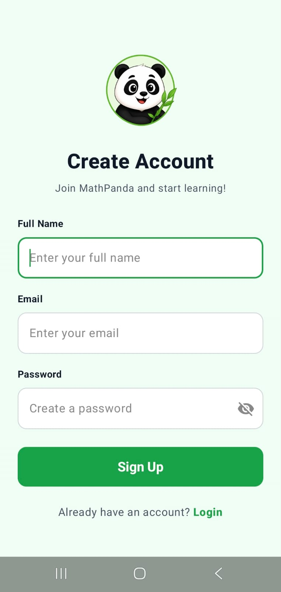
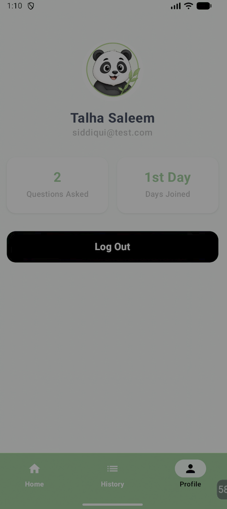

<div align="center">


# MathPanda

### An AI Android Application

*Ask any math question. Get a friendly, step-by-step explanation, spoken out loud.*

</div>

**MathPanda** is an Android app that works like a personal math tutor. You type a math question, and instead of only giving the final answer, MathPanda solves it **one step at a time**, explains every step in simple language, and **reads each step aloud**. Your past tutoring sessions are saved in your account, so you can come back and review them anytime.

The app is built with **Kotlin and Jetpack Compose**. The AI part runs on a small **Python (FastAPI) backend** that uses **Google Gemini** to create the solution and **gTTS** to turn each step into voice.

---

## 📑 Table of Contents

- [About the Project](#-about-the-project)
- [Key Features](#-key-features)
- [Screenshots](#-screenshots)
- [How It Works](#-how-it-works)
- [Tech Stack](#-tech-stack)
- [Project Structure](#-project-structure)
- [Getting Started](#-getting-started)
  - [Prerequisites](#prerequisites)
  - [1. Get a Gemini API Key](#1-get-a-gemini-api-key)
  - [2. Set Up the Backend](#2-set-up-the-backend)
  - [3. Set Up the Android App](#3-set-up-the-android-app)
- [API Reference](#-api-reference)
- [Configuration](#-configuration)
- [Troubleshooting](#-troubleshooting)
- [License](#-license)

---

## 📖 About the Project

Many students get stuck not because they can't find the answer, but because they don't understand *how* to reach it. MathPanda is designed to fix that. It behaves like a patient, friendly tutor: it breaks a problem into small steps, explains the reasoning behind each one, and speaks the explanation so learners can listen and follow along.

The project has two parts:

| Component | Description |
|-----------|-------------|
| 📱 **Android App** | Kotlin + Jetpack Compose client with sign up / log in, a home dashboard, the AI tutor screen, session history, and a profile page. |
| 🖥️ **Backend Server** | Python FastAPI service (`basictesting.py`) that talks to Google Gemini for the solution and gTTS for voice audio. |

---

## ✨ Key Features

- 🧠 **AI-Powered Solutions**: Uses Google Gemini 2.5 Flash to solve math problems.
- 🪜 **Step-by-Step Explanations**: Every answer is broken into clear, easy-to-follow steps.
- 🔊 **Voice Narration**: Each step is converted to speech (British English voice) and played inside the app.
- 🐼 **Friendly Tutor Personality**: "MathPanda" keeps explanations fun and encouraging.
- 🔐 **User Accounts**: Sign up and log in to get your own personal space in the app.
- 🕘 **Session History**: Review your previous tutoring sessions and open any session to see its details.
- 👤 **Profile Screen**: View and manage your account information.
- 🛡️ **Graceful Error Handling**: If the AI fails or returns an invalid response, the backend sends a friendly fallback message (with audio) instead of crashing.
- 🌐 **Simple REST API**: A single `/tutor` endpoint that is easy to test and extend.

---

## 📸 Screenshots

<div align="center">

| Sign Up | Log In | Home | MathPanda AI Tutor |
|:---:|:---:|:---:|:---:|
|  |  |  |  |

| MathPanda AI Tutor | History | Session Details | 
|:---:|:---:|:---:|
| |  |  | 

| Profile |
|:---:|
|  |
</div>

---

## ⚙️ How It Works

```
┌────────────────┐   1. POST /tutor          ┌──────────────────────┐
│                │   {"message": "2x+3=11"}  │                      │
│  Android App   │ ────────────────────────► │   FastAPI Backend    │
│ (Kotlin/Compose│                           │  (basictesting.py)   │
│                │                           │                      │
│                │                           │  2. Send prompt ───► │ ──► Google Gemini
│                │                           │     + instructions   │ ◄── 3. JSON steps
│                │                           │                      │
│                │                           │  4. Convert each     │
│                │                           │     step to MP3 ───► │ ──► gTTS
│                │   5. JSON array of        │     (base64)         │
│                │ ◄──────────────────────── │                      │
└────────────────┘   [{speech, audio}, ...]  └──────────────────────┘
```

1. The student types a math question on the AI Tutor screen.
2. The app sends it to the backend's `/tutor` endpoint.
3. The backend wraps the question in a **system instruction** that tells Gemini to act as *MathPanda* and return the solution strictly as a JSON array of `{"speech": "..."}` steps.
4. The backend generates an MP3 for every step using **gTTS**, encoded as a base64 data URI.
5. The app receives the list of steps (text + audio), shows them, and plays them one by one.

---

## 🛠️ Tech Stack

### 📱 Android App
| Technology | Purpose |
|------------|---------|
| **Kotlin** | Primary language |
| **Jetpack Compose** | Modern declarative UI (Material theme in `ui/theme`) |
| **Firebase** | User authentication and account services (`FirebaseManager.kt`) |
| **Gradle (Kotlin DSL)** | Build system with a version catalog (`gradle/libs.versions.toml`) |
| **Google Services plugin** | Connects the app to your Firebase project |

### 🖥️ Backend
| Technology | Purpose |
|------------|---------|
| **Python 3.9+** | Backend language |
| **FastAPI** | REST API framework |
| **Uvicorn** | ASGI server |
| **Pydantic** | Request validation |
| **Google GenAI SDK** (`google-genai`) | Access to Gemini 2.5 Flash |
| **gTTS** | Text-to-speech (Google Text-to-Speech) |

---

## 📂 Project Structure

```
MathPanda-An-Ai-Android-Application-/
├── app/                                  # Android application module
│   ├── src/
│   │   ├── main/
│   │   │   ├── java/com/example/mentora/
│   │   │   │   ├── ui/theme/             # Compose theme (colors, typography)
│   │   │   │   ├── AudioPlayer.kt        # Plays the voice narration
│   │   │   │   ├── AuthScreen.kt         # Sign up / Log in
│   │   │   │   ├── DashboardScreen.kt    # Home screen
│   │   │   │   ├── FirebaseManager.kt    # Firebase integration
│   │   │   │   ├── HistoryScreen.kt      # Past sessions
│   │   │   │   ├── InteractionScreen.kt  # MathPanda AI Tutor chat screen
│   │   │   │   ├── MainActivity.kt       # App entry point
│   │   │   │   ├── MentoraApi.kt         # Communication with the backend
│   │   │   │   └── ProfileScreen.kt      # User profile
│   │   │   ├── keepRules/rules.keep
│   │   │   ├── res/
│   │   │   │   ├── drawable/             # intro.png, panda.png, panda_avatar.png, launcher icons
│   │   │   │   ├── mipmap-*/             # App launcher icons
│   │   │   │   ├── values/               # colors.xml, strings.xml, themes.xml
│   │   │   │   └── xml/                  # backup rules, data extraction rules, network security config
│   │   │   └── AndroidManifest.xml
│   │   ├── androidTest/                  # Instrumented tests
│   │   └── test/                         # Unit tests
│   ├── .gitignore
│   └── build.gradle.kts                  # App-level Gradle config
├── gradle/
│   ├── wrapper/                          # Gradle wrapper (jar + properties)
│   ├── gradle-daemon-jvm.properties
│   └── libs.versions.toml                # Version catalog
├── images/                               # Screenshots used in this README
├── .gitignore
├── basictesting.py                       # FastAPI backend (Gemini + gTTS)
├── build.gradle.kts                      # Project-level Gradle config
├── gradle.properties                     # Project-wide Gradle settings
├── gradlew                               # Gradle wrapper script (Linux / macOS)
├── gradlew.bat                           # Gradle wrapper script (Windows)
├── settings.gradle.kts                   # Project settings and repositories
└── README.md
```

### App Modules at a Glance

| File | Responsibility |
|------|----------------|
| `MainActivity.kt` | Launches the app and hosts the Compose UI. |
| `AuthScreen.kt` | Sign up and log in screens. |
| `DashboardScreen.kt` | Home screen after login. |
| `InteractionScreen.kt` | The AI tutor screen where questions are asked and step-by-step answers appear. |
| `HistoryScreen.kt` | List of previous tutoring sessions and their details. |
| `ProfileScreen.kt` | Profile information of the logged-in user. |
| `MentoraApi.kt` | Sends questions to the backend `/tutor` endpoint and reads the response. |
| `AudioPlayer.kt` | Plays the base64 MP3 audio returned for each step. |
| `FirebaseManager.kt` | Handles Firebase-related operations. |

---

## 🚀 Getting Started

### Prerequisites

| Tool | Version | Notes |
|------|---------|-------|
| [Android Studio](https://developer.android.com/studio) | Latest stable | Includes the Android SDK |
| JDK | 17 or higher | Bundled with Android Studio |
| [Python](https://www.python.org/downloads/) | 3.9 or higher | For the backend |
| Git | Any recent version | To clone the repo |
| Gemini API key | n/a | Free from Google AI Studio |
| Firebase project | n/a | Needed for `google-services.json` |
| Internet connection | n/a | Required by Gemini and gTTS |

### 1. Get a Gemini API Key

1. Go to [Google AI Studio](https://aistudio.google.com/app/apikey).
2. Sign in and click **Create API key**.
3. Copy the key. You'll paste it into the backend in the next step.

### 2. Set Up the Backend

**a) Clone the repository**

```bash
git clone https://github.com/TalhaSaleemSiddiqui/MathPanda-An-Ai-Android-Application-.git
cd MathPanda-An-Ai-Android-Application-
```

**b) (Recommended) Create a virtual environment**

```bash
# macOS / Linux
python3 -m venv venv
source venv/bin/activate

# Windows
python -m venv venv
venv\Scripts\activate
```

**c) Install dependencies**

```bash
pip install fastapi uvicorn pydantic google-genai gTTS
```

**d) Add your Gemini API key**

Open `basictesting.py` and replace the placeholder:

```python
MY_API_KEY = "Enter_Your_Gemini_key"
```

with your real key. *(See [Security Notes](#-security-notes) for a safer way using environment variables.)*

**e) Run the server**

```bash
python basictesting.py
```

The server starts on **`http://0.0.0.0:8080`**. Verify it by opening the interactive API docs at **http://localhost:8080/docs**.

### 3. Set Up the Android App

**a) Open the project**

1. Launch **Android Studio**.
2. Select **File → Open** and choose the project's root folder.
3. Wait for the **Gradle sync** to finish.

**b) Connect your own Firebase project**

The project applies the `com.google.gms.google-services` plugin, and `google-services.json` is not included in the repository.

1. Create a project in the [Firebase Console](https://console.firebase.google.com/).
2. Register an Android app using the application ID defined in `app/build.gradle.kts` (the source package is `com.example.mentora`).
3. Enable the sign-in method(s) and Firebase services that the app uses.
4. Download `google-services.json` and place it inside the **`app/`** folder.

**c) Point the app to your backend**

Set the backend base URL in **`MentoraApi.kt`**, depending on where you run the app:

| Where you run the app | Base URL to use |
|------------------------|-----------------|
| Android Emulator | `http://10.0.2.2:8080/` |
| Physical device (same Wi-Fi as your PC) | `http://<YOUR_PC_LOCAL_IP>:8080/` (e.g. `http://192.168.1.10:8080/`) |
| Deployed server | `https://your-domain.com/` |

> 💡 On Windows, find your local IP with `ipconfig`. On macOS/Linux, use `ifconfig` or `ip a`.
> Also make sure your firewall allows incoming connections on port **8080**.

**d) Allow HTTP traffic to your local server (development only)**

Android blocks plain `http://` traffic by default. The project has a network security configuration in `app/src/main/res/xml/`. When testing against a local `http://` backend, make sure that configuration allows cleartext traffic for your backend's host (for example `10.0.2.2` or your PC's IP).

> ⚠️ Use HTTPS in production and remove any cleartext exceptions.

**e) Build and run**

Click ▶️ **Run** in Android Studio, **or** use the Gradle wrapper:

```bash
# macOS / Linux
./gradlew assembleDebug

# Windows
gradlew.bat assembleDebug
```

The debug APK will be generated at `app/build/outputs/apk/debug/`.

---

## 📡 API Reference

### `POST /tutor`

Solves a math question and returns the solution as a list of steps with audio.

**Request**

```http
POST /tutor HTTP/1.1
Content-Type: application/json
```

```json
{
  "message": "Solve 2x + 3 = 11"
}
```

| Field | Type | Required | Description |
|-------|------|----------|-------------|
| `message` | `string` | ✅ | The math question from the user. |

**Successful Response** (`200 OK`)

```json
[
  {
    "speech": "Hello! Let's solve 2x plus 3 equals 11 together.",
    "audio": "data:audio/mp3;base64,//uQx..."
  },
  {
    "speech": "First, subtract 3 from both sides to get 2x equals 8.",
    "audio": "data:audio/mp3;base64,//uQx..."
  },
  {
    "speech": "Now divide both sides by 2. So x equals 4!",
    "audio": "data:audio/mp3;base64,//uQx..."
  }
]
```

| Field | Type | Description |
|-------|------|-------------|
| `speech` | `string` | The text of one explanation step. |
| `audio` | `string \| null` | Base64-encoded MP3 as a data URI (`data:audio/mp3;base64,...`). `null` if audio generation failed. |

**Fallback Response**

If Gemini fails or returns invalid JSON, the server still responds with a friendly message:

```json
[
  {
    "speech": "My math brain got frozen! Please ask again.",
    "audio": "data:audio/mp3;base64,//uQx..."
  }
]
```

**Quick test with cURL**

```bash
curl -X POST http://localhost:8080/tutor \
  -H "Content-Type: application/json" \
  -d '{"message": "What is 15% of 200?"}'
```

---

## 🔧 Configuration

| Setting | Location | Default | Description |
|---------|----------|---------|-------------|
| `MY_API_KEY` | `basictesting.py` | `"Enter_Your_Gemini_key"` | Your Google Gemini API key. |
| Model | `basictesting.py` | `gemini-2.5-flash` | Gemini model used to generate solutions. |
| TTS language / accent | `basictesting.py` | `lang='en'`, `tld='co.uk'` | Change to alter voice language or accent. |
| Host / Port | `basictesting.py` | `0.0.0.0:8080` | Server address and port. |
| CORS | `basictesting.py` | `allow_origins=["*"]` | Allowed origins; restrict in production. |
| Backend URL (app) | `MentoraApi.kt` | n/a | Address of your running backend. |
| Firebase config | `app/google-services.json` | n/a | Your own Firebase project file (not in the repo). |
| Gradle JVM memory | `gradle.properties` | `-Xmx2048m` | Memory for the Gradle daemon. |

---

## 🩺 Troubleshooting

| Problem | Possible Cause | Solution |
|---------|----------------|----------|
| App can't reach the server | Wrong base URL | Use `10.0.2.2` on the emulator, or your PC's local IP on a real device. Set it in `MentoraApi.kt`. |
| `Cleartext HTTP traffic not permitted` | Android blocks HTTP | Allow your backend host in the network security config (dev only) or use HTTPS. |
| Connection timeout on a real device | Firewall or different network | Allow port 8080 in the firewall; keep phone and PC on the same Wi-Fi. |
| "My math brain got frozen!" message | Invalid API key, quota exceeded, or Gemini returned non-JSON | Check the server console logs, and verify your key and quota. |
| `audio` is `null` | gTTS failed (no internet or rate limit) | Check the server's internet connection and retry. |
| Gradle sync fails | Missing SDK or JDK | Install the required SDK in Android Studio and use JDK 17+. |
| Build error about `google-services.json` | File is missing | Add your Firebase `google-services.json` to the `app/` folder. |
| Login / sign up fails | Firebase not configured | Confirm the sign-in method is enabled in your Firebase project. |
| `ModuleNotFoundError` in Python | Dependencies not installed | Run `pip install fastapi uvicorn pydantic google-genai gTTS`. |

---

## 📄 License

This project is licensed under the **MIT License**. See the [LICENSE](LICENSE) file for details.

---
